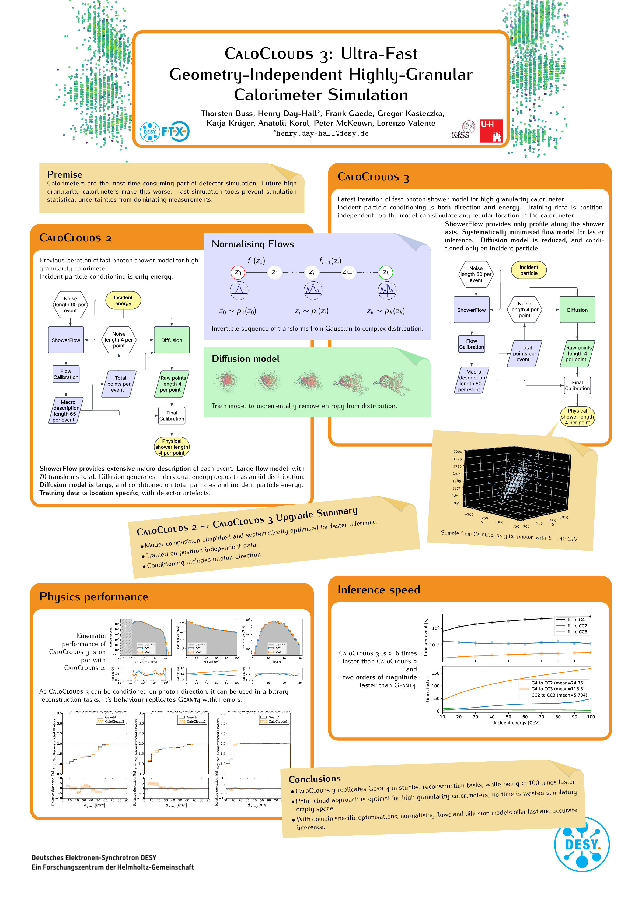

# CaloClouds 3

### Thorsten Buss^1,2^, Henry~Day-Hall^2^, Frank Gaede^2^, Gregor Kasieczka^1^, Katja Krüger^2^, Anatolii Korol^2^, Thomas Madlener^2^, Peter McKeown^3^, Martina Mozzanica^1^, Lorenzo Valente^1^
^1^DESY, ^2^University of Hamburg, ^3^CERN

This repository stands as a placeholder for the code of the CaloClouds 3 project,
which will be released as soon as the paper is out of review.

For the time being we include the latest of the public material about the project.

